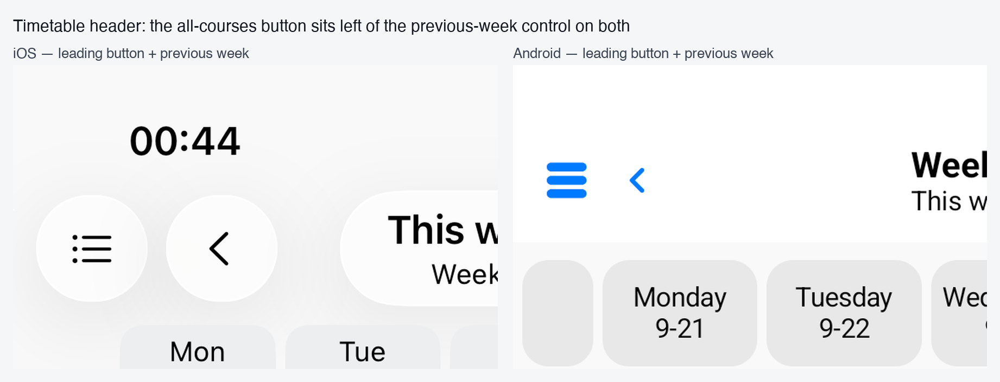
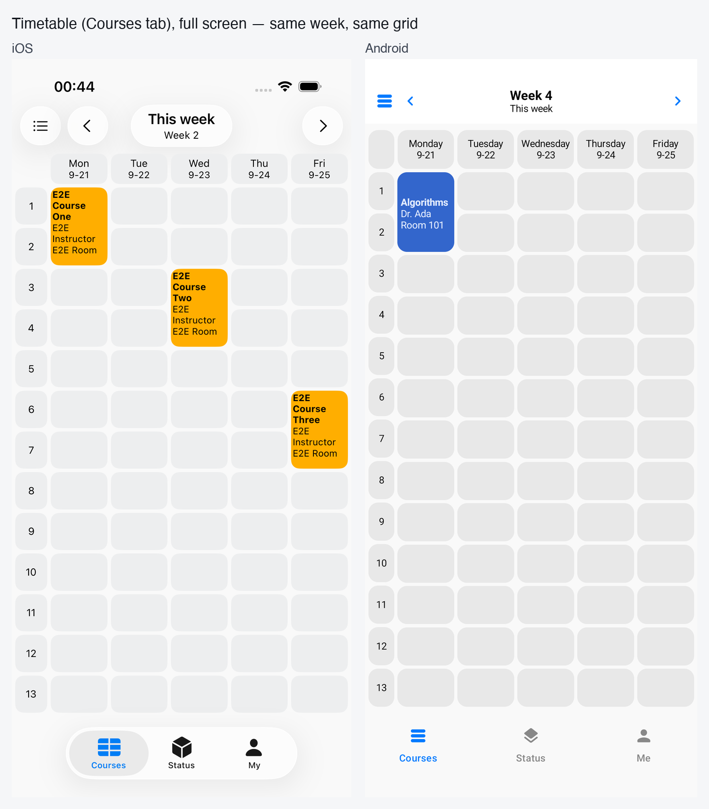
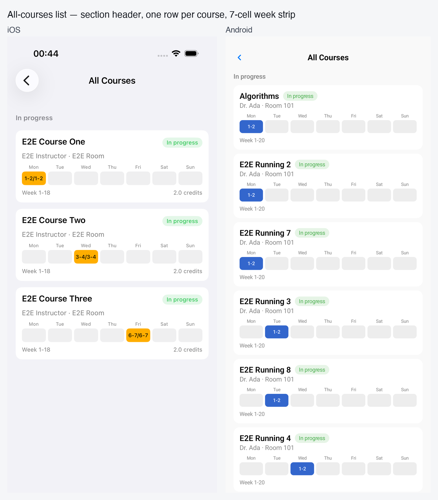
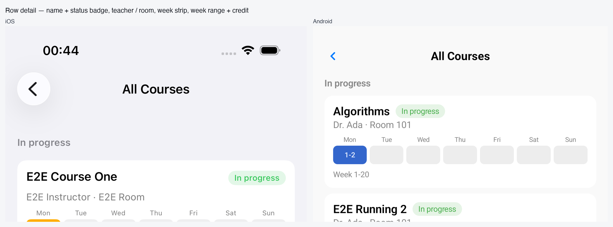
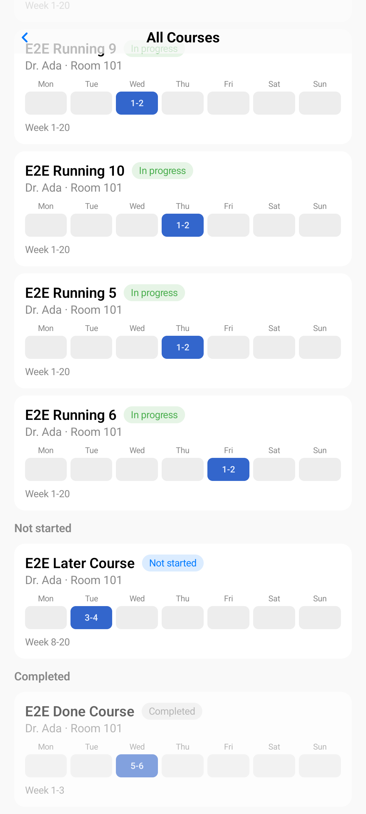

# All-courses list — verification record

Companion to `tasks/course-all-list.md`. Records what was built, what was run, and the layout
parity between the two clients, with the side-by-side captures this file references.

Client pull requests: whu-ham/ham-ios#167 · whu-ham/ham-android#131.
Workspace issue: whu-ham/ham-workspace#18.

## Where the button is — the same slot on both clients

Both clients put the button in the timetable's own header bar, as the leading control, immediately
left of the previous-week control:

- **iOS** — that bar is `CourseViewHeaderView` (previous week, week label, next week).
- **Android** — the same bar is `CourseMainViewWeekChoiceView`; "week switcher" is only its internal
  name, and it carries exactly the same previous-week button, week label and next-week button.

So the two screenshots below are the same control in the same place, not two different features.

## Layout parity (side-by-side, iOS left / Android right)

### 1. Timetable header — the leading all-courses button

The button is the leading control of the timetable header, left of the previous-week chevron, on
both. iOS draws `list.bullet`, Android draws `TableRows` — the same list mark in both icon sets.

### 2. The all-courses page

Both render: a navigation title (全部课程 / All Courses), one section header (进行中 / In progress),
one card per course with the same internal spacing, and the same 7-cell weekday strip.

### 3. One row, at readable size

Row content and order are identical: name + status badge on the first line, teacher · room on the
second, the seven weekday cells on the third (filled with the course colour where the course meets),
and week range + credit on the fourth.

### 4. The already-taken section (reached by scrolling / swiping up)

On Android the seeded data covers all three states, and this capture is taken after swiping up:
进行中 is followed by 未开始 and then 已上过 last (`E2E Done Course`, weeks 1-3 of a term in week 4),
which is the behaviour the requirement asks for.

The iOS E2E seed pins every seeded course to the current week, so iOS shows the in-progress section
only — the section *order* on iOS is pinned by `CourseAllListViewModel.buildSections` (the same
0/1/2 ordering as Android) rather than by a capture. This is the one parity item that is proven by
code and by the Android capture, not by an iOS capture.

## Source captures

| File | What |
| --- | --- |
| `assets/course-timetable-ios.png` | iOS timetable with the new leading button (1206x2622) |
| `assets/course-timetable-android.png` | Android timetable with the new leading button (1080x2400) |
| `assets/all-course-list-ios.png` | iOS all-courses page (1206x2622) |
| `assets/all-course-list-android-top.png` | Android all-courses page, top (1080x2400) |
| `assets/all-course-list-android-completed.png` | Android all-courses page after swiping up (1080x2400) |

## Verification actually run

| Check | Command | Result |
| --- | --- | --- |
| Android compile | `./gradlew :feature:course:compileDebugKotlin` | BUILD SUCCESSFUL (3m40s) |
| Android app + tests build | `./gradlew :app:assembleGithubDebug :app:assembleGithubDebugAndroidTest` | BUILD SUCCESSFUL |
| Android JVM unit tests | `./gradlew :feature:course:testDebugUnitTest` | BUILD SUCCESSFUL — 7 new cases + existing pass |
| Android E2E on emulator (Medium_Phone AVD, API 37) | `adb shell am instrument -w -e class com.nowcent.ham.e2e.suite.course.CourseAllCourseListE2eTest com.nowcent.ham.test/com.nowcent.ham.HiltTestRunner` | `OK (3 tests)`; `connectedGithubDebugAndroidTest`: 3 run / 0 failed |
| iOS app build | `xcodebuild -workspace Ham/Ham.xcworkspace -scheme "Ham (iOS)" -configuration Debug -destination 'platform=iOS Simulator,name=iPhone 17 Pro' build` | ** BUILD SUCCEEDED ** |
| iOS E2E on simulator (iPhone 17 Pro) | `xcodebuild -workspace Ham/Ham.xcworkspace -scheme "Tests iOS" -configuration Debug -destination 'platform=iOS Simulator,name=iPhone 17 Pro' -only-testing:Tests\ iOS/HamE2ECourseAllListTests test` | ** TEST SUCCEEDED ** — 3 run / 3 passed / 0 failed (61.5s) |

Both clients were started from `ham-workspace` pinned at `origin/main` (2c070fec) with every
submodule at its latest `origin/main`: ham-android 1b68e365, ham-ios 42e32927, ham-backend-go
253e206, ham-proto d63af3e, ham-rn 7578b30, ham-web b614546, whu-ham.github.io 4312d20.

## Key findings

- The earlier round's work was never committed or pushed, its iOS E2E test did not compile
  (`HeaderButton.allCourseList` did not exist), its Android graph file had a duplicate import, and it
  sat on stale submodule heads. All fixed in this round.
- Real test bugs found while verifying on-device: iOS `When.tapIdentifier` never expired the 4 s label
  cache (fixed in shared `Assertions.swift`); the third iOS case's `showsNone(["Mon", ...])` premise
  was wrong because each row's own week strip prints weekday names (rewritten to assert the section
  band); `Label.courseAllList` had to live under `Label`, not `Seed`.
- Android JVM unit tests needed `testOptions { unitTests { isReturnDefaultValues = true } }` because
  `displayColor` touches `android.graphics.Color.parseColor` through `toColorInt()`.
- Environment-only hiccups (resolved, no source change): stale Gradle cache for
  `:integration:social-login`; `Ham/Podfile.lock` checksum drift after `pod install` was left out of
  the commit to keep the PR diff clean.
